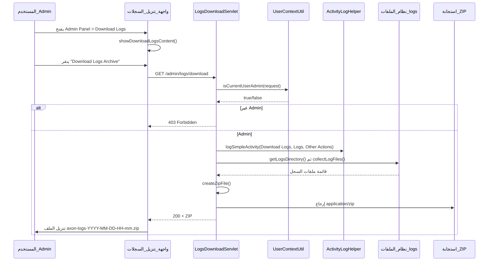

# شرح ميزة Download Logs (تنزيل السجلات)

هذا الملف يوضح **كيف تعمل ميزة تنزيل السجلات** من البداية للنهاية: من واجهة الإدارة، مروراً بالـ Backend، وحتى تنزيل أرشيف ZIP وتسجيل النشاط في سجل التدقيق.

---

## الهدف من الميزة

تمكين مسؤولي النظام (Admins) من تنزيل جميع ملفات السجلات (Errors, Application, Audit) كأرشيف ZIP واحد من لوحة الإدارة، مع تسجيل كل عملية تنزيل في سجل التدقيق.

---

## تدفق العمل (Flow)



---

## 1. الواجهة الأمامية (Frontend)

### الملفات المعنية

- `src/main/webapp/assets/js/admin-panel/operational-management/download-logs.js` — منطق الصفحة والتنزيل
- `src/main/webapp/admin-panel.html` — عنصر القائمة "Download Logs"
- `src/main/webapp/assets/js/admin-panel/main.js` — تحميل السكربت وتوجيه القائمة

### آلية العمل

- عند اختيار **"تنزيل السجلات"** من القائمة الجانبية (Operational Management) يتم استدعاء `showDownloadLogsContent(contentArea)` التي تعرض:
  - عنوان الصفحة ووصفها
  - بطاقة توضح أنواع السجلات:
    - **Error Logs** — `prod_errors-*.log`
    - **Application Logs** — `prod_app-*.log`
    - **Audit Logs** — `prod_audit-*.log`
  - زر **"Download Logs Archive"**

- عند النقر على الزر تُستدعى الدالة `handleDownloadLogs()`:
  1. تعطيل الزر وعرض "Downloading..."
  2. طلب **GET** إلى `/admin/logs/download` مع `credentials: 'include'` و `Accept: application/zip`
  3. **في حال النجاح:** قراءة الـ response كـ `blob`، إنشاء `<a download>` مؤقت، استخراج اسم الملف من هيدر `Content-Disposition` (إن وُجد) ثم تنزيل الملف كـ `axon-logs-YYYY-MM-DD-HH-mm.zip`
  4. **في حال الخطأ:** عرض رسالة مناسبة (مثلاً 403 = صلاحيات، 404 = لا توجد ملفات أو مجلد السجلات غير موجود)
  5. بعد 5 ثوانٍ يتم إخفاء رسالة الحالة

---

## 2. الـ Backend — Servlet تنزيل السجلات

**الملف:** `src/main/java/com/example/budg_v2/admin/LogsDownloadServlet.java`  
**المسار (URL):** `GET /admin/logs/download` (من خلال `@WebServlet("/admin/logs/download")`)

### الخطوات داخل الـ Servlet

1. **التحقق من الصلاحيات**  
   استدعاء `UserContextUtil.isCurrentUserAdmin(request)`. إن لم يكن المستخدم Admin يُرجع **403** مع رسالة "Forbidden: Admin access required".

2. **تسجيل النشاط في سجل التدقيق**  
   استدعاء:
   ```java
   ActivityLogHelper.logSimpleActivity(request,
       ActivityLogConstants.SETTING_DOWNLOAD_LOGS,   // "Download Logs"
       ActivityLogConstants.COMPONENT_LOGS,          // "Logs"
       ActivityLogConstants.CHANGE_TYPE_OTHER_ACTIONS);
   ```
   يتم ذلك عبر `ActivityLogHelper` و `AdminActivityLogService` (تسجيل بسيط بدون تفاصيل إضافية).

3. **تحديد مجلد السجلات**  
   الدالة `getLogsDirectory()` تبحث بالترتيب في:
   - `catalina.base/logs`
   - `catalina.home/logs`
   - `./logs` (نسبي من مسار التشغيل)
   - مسار من الـ Servlet Context: `/logs`
   - `user.dir/logs`
   - مجلد `logs` في المجلد الأب لـ `user.dir`  
   إذا لم يُعثر على مجلد تُرجع **404** مع رسالة توضح المواقع التي تم البحث فيها.

4. **جمع ملفات السجل**  
   الدالة `collectLogFiles(logsDir)` تجمع الملفات التي تطابق:
   - الأنماط: `prod_errors-*.log`, `prod_app-*.log`, `prod_audit-*.log` (مثل الملفات المُدارَة بتواريخ من Logback)
   - وأيضاً الملفات الحالية بدون تاريخ في الاسم: `prod_errors.log`, `prod_app.log`, `prod_audit.log`  
   ثم إزالة التكرار وترتيب الملفات حسب الاسم. إذا لم يُعثر على أي ملف تُرجع **404** مع رسالة "No log files found...".

5. **إنشاء أرشيف ZIP**  
   `createZipFile(logFiles, baseDir)` يبني ZIP في الذاكرة (`ByteArrayOutputStream` + `ZipOutputStream`) ويضيف كل ملف سجل كـ entry باسم الملف فقط (بدون مسار فرعي).

6. **إرسال الاستجابة**  
   - `Content-Type: application/zip`
   - `Content-Disposition: attachment; filename="axon-logs-YYYY-MM-DD-HH-mm.zip"`
   - كتابة بايتات الـ ZIP إلى `response.getOutputStream()`.

أي استثناء آخر يُترجم إلى **500** مع رسالة خطأ JSON.

---

## 3. مصدر ملفات السجل — Logback

**الملفات:** `src/main/resources/logback.xml` و `logback-spring.xml`

- المتغير **LOG_DIR**: من `-DLOG_DIR` أو متغير بيئة، وإلا الافتراضي `logs`.
- ثلاثة Appenders لملفات الإنتاج:
  - **ERROR_APPENDER**: `prod_errors.log` + تدوير يومي `prod_errors-yyyy-MM-dd.log` (مستوى ERROR فقط).
  - **APP_APPENDER**: `prod_app.log` + تدوير يومي `prod_app-yyyy-MM-dd.log` (كل المستويات).
  - **AUDIT_APPENDER**: `prod_audit.log` + تدوير يومي `prod_audit-yyyy-MM-dd.log` (أحداث التدقيق عبر AuditLogFilter).

الـ Servlet يبحث عن نفس أسماء الملفات والأنماط في مجلد `logs` (أو المسار الذي يُحدده `getLogsDirectory()`)، لذا يجب أن يكون **LOG_DIR** أو مسار التشغيل متوافقاً مع المواقع التي يفحصها الـ Servlet (مثل `catalina.base/logs` أو `./logs`).

---

## 4. الثوابت والترجمة

- **ActivityLogConstants**: `SETTING_DOWNLOAD_LOGS = "Download Logs"`, `COMPONENT_LOGS = "Logs"`, `CHANGE_TYPE_OTHER_ACTIONS = "Other Actions"`.
- **الترجمة**: نصوص الواجهة في `src/main/webapp/assets/i18n/en.json` و `ar.json` تحت `adminPanel.downloadLogs.*` (عنوان الصفحة، الوصف، أسماء أنواع السجلات، رسائل النجاح/الخطأ).

---

## 5. ملخص سريع

| المرحلة           | ما يحدث                                                                               |
| ----------------- | ------------------------------------------------------------------------------------- |
| الدخول للصفحة     | عرض واجهة "Download Logs" مع وصف أنواع السجلات وزر التنزيل.                           |
| النقر على التنزيل | طلب GET إلى `/admin/logs/download`.                                                   |
| التحقق            | التحقق من أن المستخدم Admin؛ إن لم يكن → 403.                                         |
| التدقيق           | تسجيل "Download Logs" / "Logs" / "Other Actions" في سجل نشاط الإدارة.                 |
| القراءة           | البحث عن مجلد السجلات ثم جمع الملفات المطابقة لـ prod_errors / prod_app / prod_audit. |
| التغليف           | إنشاء ZIP في الذاكرة وإرجاعه مع اسم `axon-logs-YYYY-MM-DD-HH-mm.zip`.                 |
| الواجهة           | استقبال الـ blob وتشغيل تنزيل الملف وعرض رسالة نجاح أو خطأ.                           |

بهذا تكون آلية عمل **Download Logs** من الواجهة حتى الـ Backend وتنزيل أرشيف السجلات وتسجيل النشاط واضحة بالكامل.
