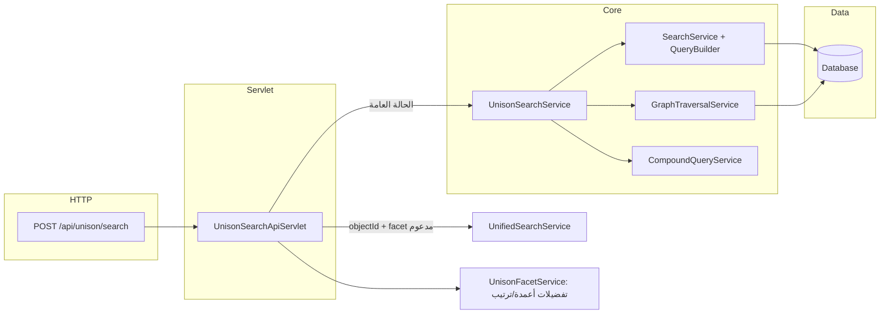

# Unison Search — شرح منطق الـ Backend ومراجعة سريعة

هذا الملف يشرح **تدفق التنفيذ الكامل** لمسار البحث الموحّد (Unison Search) في الخادم (Java، الحزمة `com.example.unisonsearch`)، ويعرض **نقاط قوة، سلوكيات مهمّة، وثغرات/اعوجاجات محتملة** رصدت أثناء قراءة الكود.

للمرجع السريع لنقاط الـ API انظر أيضًا: [`unison-search-backend.md`](./unison-search-backend.md).

---

## 1. الصورة الكبيرة (من الطلب إلى الـ JSON)

1. **`UnisonSearchApiServlet`** يقرأ JSON → `UnisonSearchRequest`، يحدد **`maxDepth`**، ويختار إما **`UnifiedSearchService`** (عند وجود `objectId` و facet من القائمة المحدودة) أو **`UnisonSearchService.executeUnisonSearch`**.
2. يُستخرج **`userId`** من السمة، الجلسة، أو كوكي `ACCESS_TOKEN` لتطبيق **تفضيلات الـ facets** و**تصفية الـ segment** عند توفر مستخدم.
3. **`UnisonSearchService`** يمرّ على قائمة **`searches`** (شروط مع مشغّلات FIND / AND / OR / NOT)، يبني **بذور بحث (seed IDs)**، يوسّع عبر **الرسم البياني** عند الحاجة، يدمج النتائج بعمليات مجموعات، ثم **يملأ الصفوف** ويثرّيها ويبني **`relatedObjects`**.

---

## 2. المصادقة والوصول

- **`AuthFilter`** يمرّر طلبات **`/api/unison/*` دون مصادقة** (بحث عام). أي بيانات يرجعها البحث تكون **مرئية لأي عميل** يستطيع الوصول للخادم — هذا قرار منتج/أمني وليس خطأ منطق بحت.
- عند **`userId` صالح**: يُبنى **`SegmentAccessContext`** (عبر `SegmentAccessService`: سوبر أدمن، مكعّب الـ segments، إلخ) ويُمرَّر لـ SQL والاجتياز لاحترام **حدود الـ segment**.

---

## 3. نموذج الطلب (`UnisonSearchRequest`)

- **`searches`**: مصفوفة من **`SearchItem`** (مشغّل، facet، كلمة مفتاحية، فلاتر، حقول بحث، خيارات هرمية، مستوى إزاحة بصري `indentLevel`).
- **`options.maxDepth`**:
  - **`0`**: بدون اجتياز — نتائج البذور فقط لكل شرط.
  - **`1`** (الافتراضي في النموذج): طبقة علاقات واحدة من البذور.
  - **`< 0`**: الـ servlet يضبطها إلى **`1`**.
- **`maxDepth > 1`**: يُفعَّل مسار **«كون جذري» (root universe / `TraversalScope`)** بعد أول FIND كما في القسم 5.

---

## 4. التحقق من أول شرط والمشغّلات

داخل **`UnisonSearchService.executeUnisonSearch`**:

| أول مشغّل في الطلب | السلوك |
|-------------------|--------|
| **NOT** | رد خطأ: لا يمكن الاستثناء من «الفراغ». |
| **AND / OR** | يُعاد ضبط المشغّل إلى **FIND** لإنشاء «جذر» منطقي (سلوك تطبيع). |
| **null / فارغ** | يُعامل كـ **FIND**. |

للشروط **التالية**:

| المشغّل | المعنى في التنفيذ |
|---------|-------------------|
| **FIND** | يستبدل النتائج المتراكمة بالكامل (**إعادة ضبط**) ويعيد **`rootScope`** إلى `null` ثم يبدأ جذرًا جديدًا عند الحاجة. |
| **AND** | تقاطع **`FacetResult` لكل facet** عبر `CompoundQueryService.intersectResults`. حالات خاصة لإعادة حساب **SYSTEM** و **INTERFACE** من **DATASET** المفلتر بعد AND. |
| **OR** | اتحاد لكل facet عبر `unionResults` (مع دمج صفوف عند الحاجة). |
| **NOT** | استبعاد معرفات `setB` من `setA` لكل facet عبر `excludeResults`. |

**كلمة فارغة + facet مختلف عن الجذر**: منطق متقدّم يربط الجذر بالـ facet عبر **وجود/عدم وجود علاقة** (`getObjectIdsWithRelationToFacet` / `getObjectIdsWithNoRelationToFacet`) بدل بحث نصي شامل.

**AND مع كلمة في People** ووجود جذر يدعم stakeholders أو Created By: مسار **متقاطع خاص** يقيّد معرفات الجذر حسب أشخاص مطابقين للكلمة.

---

## 5. الفرق الجوهري بين `maxDepth == 1` و `maxDepth > 1`

هذا أهم «اعوجاج» معماري يجب فهمه:

- **`maxDepth == 0`**: لا يستدعى الاجتياز؛ تُخزَّن البذور فقط في الـ facet المناسب.
- **`maxDepth == 1`**: يستدعى `GraphTraversalService.findConnectedObjects` بعمق 1 مع **`rootScope = null`** (لا «كون جذري» مقيد).
- **`maxDepth > 1`**: عند **أول FIND** يُحسب **`rootUniverse`** باجتياز كامل حتى `maxDepth` مع فلاتر facet اختيارية، ثم يُبنى **`TraversalScope`** من كل المعرفات المكتشفة. الشروط اللاحقة تُقيَّد بهذا الكون حتى لا «تتسرّب» مسارات خارج نتائج الجذر.

**النتيجة**: استعلام مركّب بنفس الشروط قد يعطي **نتائج مختلفة** بين `maxDepth=1` و `maxDepth=2+` ليس فقط لعمق إضافي، بل لأن **نموذج القيد الجذري** يختلف. غالبًا مقصود لأداء الواجهة الافتراضية (عمق 1)، لكنه يجب توثيقه للمستهلكين API.

---

## 6. `GraphTraversalService` (BFS على العلاقات)

- يبدأ من **facet + seed IDs**، يستخدم **`RelationshipManager.ALLOWED_TARGETS`** و **`RelationshipService`** لجلب الجيران لكل هدف مسموح.
- **حد أدنى للأداء**: البذور تُقتطع إلى **1000** معرف؛ إجمالي النتائج يتوقف عند **10000** مع تسجيل اقتطاع (truncation).
- **`SegmentAccessContext`**: يُطبَّق على المعرفات المستخرجة حسب الـ facet.
- **`rootScope`**: قبل إدخال الطابور يُقاطَع مع **`rootScope.getAllowedIds(facet)`** لمنع تسرّب المسارات.

---

## 7. `CompoundQueryService` (عمليات على مستوى الـ facet)

- **تقاطع (AND)**: لكل facet يظهر في أيهما، تقاطع مجموعتي المعرفات؛ إن لم يكن الـ facet في أحد الجانبين تُعتبر مجموعة الجانب الناقص **فارغة** → النتيجة فارغة لهذا الـ facet.
- **اتحاد (OR)**: اتحاد المعرفات + دمج **depth** (أقل عمقًا) + دمج **rows** عند الإمكان + **`totalCount`** تقريبًا `max(totalA, totalB)` أو حجم الصفوف.
- **استثناء (NOT)**: يعيد facetات **`setA` فقط**؛ لا يضيف facetات جديدة من `setB`. **`FacetResult`** الناتج **بدون rows** في هذا المسار — أي أن طبقة العرض قد تعتمد لاحقًا على إعادة `populateFacetRows`.

---

## 8. ما بعد الدمج: صفوف، إثراء، `relatedObjects`

بعد حلقة الشروط:

1. **`populateFacetRows`**: يحوّل المجموعات من معرفات إلى **صفوف كاملة** عبر `SearchService.searchWithDefinition` مع فلاتر الـ segment؛ تخصيص لـ **Active Tasks** وغيرها.
2. **`enrichWithRelatedCRsAndTasks`** وقواعد **GOVERNED_FACETS**: إثراء عام (أدوار، أشخاص، مهام، طلبات تغيير، …) حسب المتطلبات.
3. **`canonicalizeFacetResults`**: توحيد مفاتيح الـ facets (مثل `DATA_SETS` → `DATASET`).
4. **`maxDepth == 0`**: **`filterToActiveFacet`** يبقي facet النشط فقط.
5. **`filterSingleFacetExactKeyword`**: لبحث FIND أحادي الـ facet يضيّق التطابق حسب الكلمة (تقليل ضوضاء الـ substring).
6. **`applyAccessibleTotals`**: **`totalCount`** مقيد بالوصول/الـ segment لعرض «X من Y» في الواجهة.
7. **`firstTraversalForRelated`**: يُحفظ أول اجتياز مفيد حتى لا تُفقد facets مثل **POLICY** بعد FIND لاحق أو بعد `populateFacetRows`.
8. **`relatedObjects`**: خريطة `seedFacet → { relatedFacet → Set<ids> }` للواجهة؛ مع إمكانية **اجتياز إضافي بعمق 1** لملء الفراغات.

---

## 9. المسار الموحّد (`UnifiedSearchService`)

عند **`objectId > 0`** و **`facet`** من القائمة المحدودة (dataset, system, glossary, attribute, interface, project, process, policy, capability):

- يُستخدم **`UnifiedSearchService.executeSearch`** ثم **`convertToUnisonResponse`** لتحويل الشكل إلى `UnisonSearchResponse`.
- النتائج قد تكون **أخف** من مسار Unison الكامل (مثلاً صفوف/بعض الـ facets). مناسب لسيناريو «كائن محدد + تأثيره».

---

## 10. الصف الرئيسي للواجهة: `UnisonSearchApiServlet`

- **CORS** عبر `CorsUtil`.
- **تفضيلات المستخدم**: `applyFacetPreferences` — إخفاء facets غير نشطة، ترتيب، وقص أعمدة **`rows`** حسب `activeFields` مع الإبقاء على **`ID`** والحقول المخصصة الديناميكية.
- **Gson**: مُسجَّل **Deserializer مخصص** لـ `SearchItem` للتعامل مع **`filters`** كمصفوفة أو كائن (المصفوفة تُهمل كخريطة فارغة).

---

## 11. المجموعات المزاحة (`indentLevel`)

- الصفوف ذات **`parentIndex[i] >= 0`** تُتخطّى في الحلقة الرئيسية.
- بعد معالجة صف أب **ووجود `rootFacetId`**: تُستدعى **`applyIndentedChildGroup`** لتقييم مجموعة الأبناء كتعبير فرعي على **معرفات الجذر**، ثم **`applyGroupedRootFilter`**: إعادة اجتياز من الجذر المفلتر وتقاطع مع النتائج المتراكمة.

**ملاحظة**: يعتمد سلوك المجموعات المزاحة على إرسال **`indentLevel`** صحيح في JSON (يُقرأ الآن في الـ servlet).

---

## 12. مراجعة: هل يوجد «غلط» أو سلوك يستحق الانتباه؟

### 12.1 كان هناك خلل — حقول لم تُقرأ من JSON في `UnisonSearchApiServlet` (مُصلَح)

سابقًا، الـ `JsonDeserializer` لـ `SearchItem` لم يكن يملأ **`indentLevel`** و **`hierarchicalOptions`**، فبقيا **`null`** لطلبات `POST /api/unison/search` رغم وجودهما في النموذج.

**الأثر السابق**: استعلامات API مع تداخل (nested query) أو خيارات هرمية لا تعمل كما في الواجهة.

**الحالة الحالية**: تمت إضافة التعيين في `UnisonSearchApiServlet.createGson()` لقراءة الحقلين من JSON.

### 12.2 تعليقات الكود

كان تعليق `UnisonSearchApiServlet` يذكر افتراض `maxDepth` خاطئًا؛ تمت مواءمته مع القيمة **`1`** ومع `SearchOptions` الافتراضية.

### 12.3 أمن المنتج

فتح **`/api/unison/`** بدون مصادقة يعني **كشف بيانات** بحسب صلاحيات الاستعلام الافتراضية للمستخدم المجهول (إن وُجدت). مراجعة سياسة البيانات مطلوبة وليست «خطأ منطق».

### 12.4 عدم اتساق عمق 1 مقابل أعلى

كما في القسم 5: **`TraversalScope`** لا يُستخدم عند **`maxDepth == 1`**؛ المنطق المركّب قد يختلف عن **`maxDepth > 1`**. ليس بالضرورة خطأ، لكنه **سلوك يجب توثيقه** للمستخدمين.

### 12.5 ضوضاء في السجلات

أزيلت **`System.out.println`** التصحيحية من `GraphTraversalService` (مسار attribute→dataset).

### 12.6 عمليات NOT / AND على مستوى الـ facet

- **NOT** لا يحافظ على **`rows`** في `CompoundQueryService` — يعتمد المسار اللاحق على إعادة التعبئة.
- **AND** بين facetين لا يدمج الصفوف مثل OR — طبيعي لعمليات التقاطع على المعرفات، لكن الواجهة تعتمد على `populateFacetRows` للعرض الموحّد.

---

## 13. ملفات مركزية في الكود

| الملف | الدور |
|--------|--------|
| `servlet/UnisonSearchApiServlet.java` | HTTP، Gson، Unified vs Unison، تفضيلات الـ facets |
| `service/UnisonSearchService.java` | أوركسترا البحث المركّب، البذور، الاجتياز، الحالات الخاصة |
| `service/GraphTraversalService.java` | BFS، حدود، segment، rootScope |
| `service/CompoundQueryService.java` | AND / OR / NOT على `FacetResult` |
| `service/SearchService.java` + `repository/QueryBuilder.java` | SQL و `searchGroups` |
| `filter/AuthFilter.java` | استثناء `/api/unison/` |
| `model/UnisonSearchRequest.java` / `FacetResult.java` / `UnisonSearchResponse.java` | العقود |

---

## 14. الخلاصة

- المنطق **منظم كمسار واضح**: بذور → (اختياري) اجتياز بقيود segment وربما كون جذري → دمج منطقي → تعبئة صفوف وإثراء → `relatedObjects`.
- **أقوى نقاط التصميم**: دعم segment، كون جذري عند العمق العالي، حالات خاصة (People × الجذر، إعادة SYSTEM/INTERFACE بعد AND)، واستعادة facets للعلاقات عبر `firstTraversalForRelated`.
- **مشكلة وُجدت وأُصلحت**: **`indentLevel`** و **`hierarchicalOptions`** أصبحا يُقرآن من JSON في `UnisonSearchApiServlet`.

---

*آخر مراجعة للكود: أبريل 2026 — مسارات الملفات نسبية من جذر المستودع `BUDG_V2`.*
